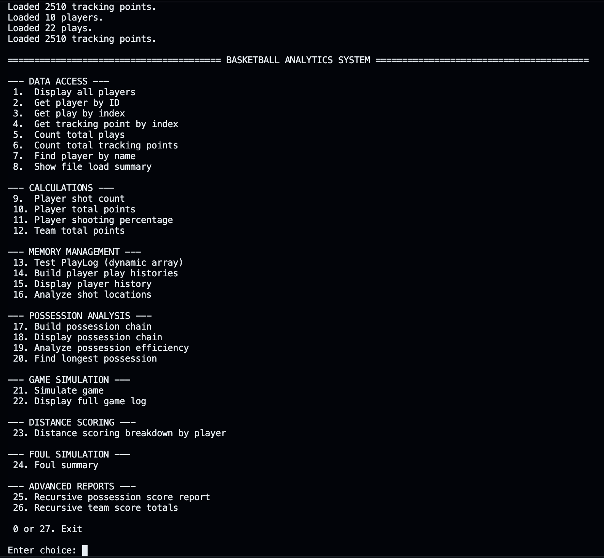
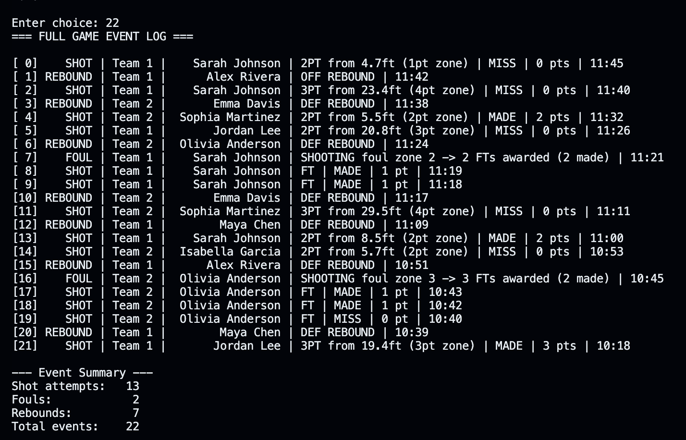
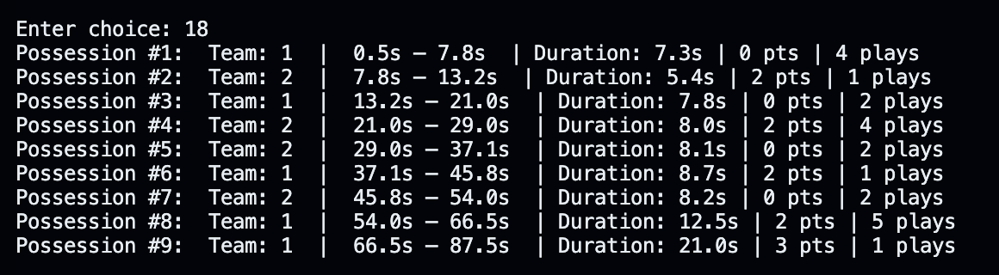

# Basketball Analytics System

A modular basketball analytics and game simulation engine built in C++ using object-oriented programming, dynamic memory management, linked lists, recursion, and file-based datasets.

This project simulates basketball gameplay events, tracks player movement data, analyzes possessions, and generates advanced scoring and foul reports using custom-built data structures and polymorphic event handling.

---

# Features

## Core Analytics
- Player statistics and scoring analysis
- Team scoring summaries
- Shooting percentage calculations
- Distance-based shot evaluation
- Possession efficiency tracking

## Simulation Engine
- Real-time game event simulation
- Dynamic foul and free-throw system
- Recursive possession scoring reports
- Full game log generation

## Data Processing
- File parsing using custom dataset loaders
- Player movement tracking
- Event-based gameplay reconstruction

## Advanced C++ Concepts
- Inheritance and polymorphism
- Abstract base classes
- Dynamic memory allocation
- Linked lists
- Recursive algorithms
- Dynamic resizing arrays
- File I/O and parsing
- Modular software architecture

---

# Technologies Used

- C++
- Object-Oriented Programming (OOP)
- Dynamic Memory Management
- Linked Lists
- Recursion
- File I/O
- Makefile Build System

---

# Project Architecture

## Main Classes

| Class | Responsibility |
|------|------|
| `Game` | Main simulation and analytics engine |
| `Player` | Stores player information |
| `PlayEvent` | Represents play-by-play events |
| `TrackingPoint` | Stores player tracking coordinates |
| `GameEvent` | Abstract base class for game events |
| `ShotEvent` | Handles scoring logic |
| `FoulEvent` | Handles foul and free-throw logic |
| `ReboundEvent` | Handles rebound events |

---

# Data Structures Used

## Dynamic Resizing Arrays
Used for:
- Play logs
- Player history tracking

## Linked Lists
Used for:
- Possession chains

## Polymorphic Arrays
Stores multiple event types through base-class pointers:
- `ShotEvent`
- `FoulEvent`
- `ReboundEvent`

via `GameEvent*`.

---

# Distance-Based Scoring System

Shot values are dynamically calculated using shot distance:

| Distance | Points |
|----------|--------|
| 0-5 ft | 1 |
| 5-15 ft | 2 |
| 15-23 ft | 3 |
| 23-30 ft | 4 |
| 30+ ft | 5 |

---

# Example Dataset

## Player Data

```txt
1,Sarah Johnson,Guard,12
2,Maya Chen,Forward,23
```

## Play Events

```txt
0,1,2PT,MISS,0,0.5,11:45
1,3,REBOUND,OFF,0,3.2,11:42
```

## Tracking Data

```txt
0,1,38.2,30.7,0.0
1,2,37.7,25.6,0.0
```

---

# Installation & Setup

## Clone Repository

```bash
git clone https://github.com/Kathan472/Basketball-Analytics-System.git
```

## Navigate Into Project Directory

```bash
cd Basketball-Analytics-System
```

## Build Project

```bash
make
```

## Run Program

```bash
./program
```

---

# Screenshots

## Main Menu


## Game Simulation


## Analytics Output


---

# Learning Outcomes

This project strengthened my understanding of:

- Large-scale C++ application design
- Memory management using raw pointers
- Polymorphism and inheritance
- Recursive algorithms
- Simulation architecture
- File parsing systems
- Data structure implementation
- Modular software engineering practices

---

# License

This project is licensed under the MIT License.